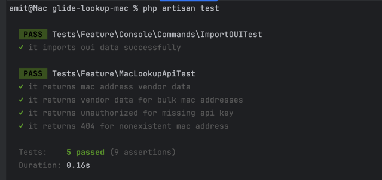
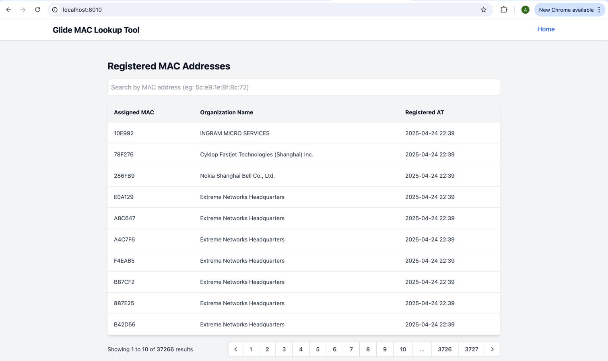
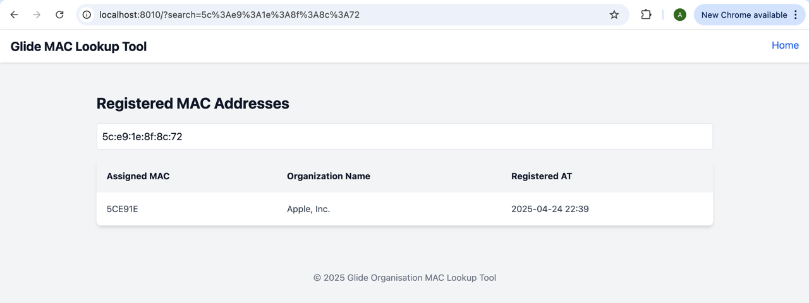

# MAC Vendor Lookup

Provides a system for identifying the manufacturer (vendor) of a device based on its MAC address.  
It imports and maintains an up-to-date database of IEEE OUI (Organizationally Unique Identifier) records, then provides both a JSON API and a basic frontend to search for vendors.

---

##  Features

- Automatically import latest IEEE OUI data
- Lookup vendors by MAC address via API (GET/POST)
- Frontend interface for users to easily search vendor based on MAC addresses

---

##  Deployment Instructions

### 1. Clone the repository

```bash
git clone https://github.com/amit9288-panchal/glide-lookup-mac.git
cd glide-mac-lookup
```

### 2. Install PHP and Node.js dependencies
```bash
composer install
npm install
```

### 3. Set up environment variables
Copy the example environment file:
```bash
cp .env.example .env
```
Generate Laravel application key:
```bash
php artisan key:generate
```
### 4. Set up your database and configure in .env than execute migration

```bash
php artisan migrate
```

### 5. Run the custom artisan command to import vendor data:

Note: if you want to manually execute command then only otherwise scheduler is set to execute every 1:00 AM
```bash
php artisan app:importOUI
```
### 6. Start the server

```bash
php artisan serve --port=8010
```

---

## Running Tests
Tests include:
1) Importing OUI data correctly
2) Single MAC address lookup API
3) Multiple MAC address lookup API

Note: Create a testing database and configure test environment
```bash
cp .env.testing.example .env.testing

php artisan migrate --env=testing
```

```bash
php artisan test
```


## CURL TO EXECUTE API 
Note: You need configure authentication key in your .env

### Get register for single mac address
```bash
REQUEST : 

curl --location 'http://localhost:8010/api/v1/mac-lookup/{mac_address}' \
--header 'X-API-KEY: *****************'

RESPONSE : 

{
    "success": true,
    "errorCode": null,
    "message": null,
    "data": [
        {
            "mac_address": "2015821A0E60",
            "vendor": "Apple, Inc."
        }
    ]
}
```

### Get register for multiple of mac address
```bash
REQUEST : 

curl --location 'http://localhost:8010/api/v1/mac-lookup/list' \
--header 'X-API-KEY: *****************' \
--header 'Content-Type: application/json' \
--data '{
  "MACAddressList": [
    "5c:e9:1e:8f:8c:72",
    "2015821A0E60"
  ]
}'

RESPONSE : 

{
    "success": true,
    "errorCode": null,
    "message": null,
    "data": [
        {
            "mac_address": "2015821A0E60",
            "vendor": "Apple, Inc."
        },
        {
            "mac_address": "5c:e9:1e:8f:8c:72",
            "vendor": "Apple, Inc."
        }
    ]
}
```

## UI
### Listing all IEEE OUI Registry


### Search for Vendor based on given MAC Address


## Future Implementation 
### Dockerized the System
- Create Dockerfile and docker-compose.yml
- Provide simple containerized development and production setups

### Implement Request/Response Logging to Elasticsearch
- Capture and store API request and response logs
- Enable advanced analytics, monitoring, and debugging with Kibana
